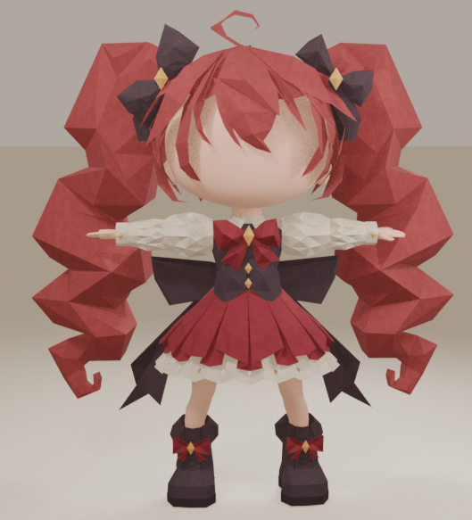

# Crimson Chibi

An editable, static origami-style character model. The character faces -Y with Z up. It has a blank face and no rig.

## Model previews

| Front | Back |
| :---: | :---: |
|  |  |

## Modeling references

| Front | Rear |
| :---: | :---: |
|  |  |

## Download and edit

- Open `crimson_chibi.blend` in Blender to edit the source model.
- Import `crimson_chibi.glb` into a glTF-compatible tool for the complete character.
- Use `parts/*.glb` for the twelve separate components. They retain their assembly coordinates; `parts/components.json` lists them.
- See `references/` for the original front, pose, and rear modeling reference images. The front reference is also packed into the Blender file.

The Blender file contains a `CRIMSON • character root` with twelve `PART` controllers. Expand a controller to edit its meshes. The `COMPONENTS • independent mesh review` scene shows the parts separately. The model uses palette materials; Blender's paper grain is not baked into GLB.

## Update the model

1. Edit and save `crimson_chibi.blend`.
2. From the repository root, run `blender -b crimson_chibi.blend --python-exit-code 1 --python scripts/export.py` (or replace `blender` with the path to your Blender executable). This refreshes the full and component GLBs.
3. Refresh the front and back pictures in `renders/` when the model changes. `blender -b crimson_chibi.blend --python-exit-code 1 --python scripts/render_preview.py` can generate a new front render. Update `CHANGELOG.md`.
4. Commit the changed source and exports. Tag a release such as `v1.0.1` and attach the `.blend` and `.glb` files to a GitHub Release.

This repository starts with the existing V04 Blender scene. The export script updates the component list alongside the GLBs.

## License

The model, modeling references, component exports, and preview renders are licensed under [Creative Commons Attribution 4.0 International](LICENSE.md). Credit the project as **Crimson Chibi** and link to this repository when sharing or adapting it. The scripts are licensed under [MIT](scripts/LICENSE).
